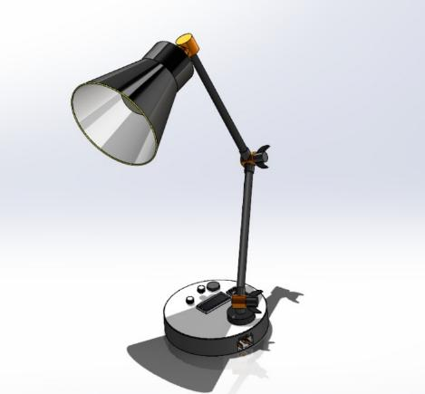
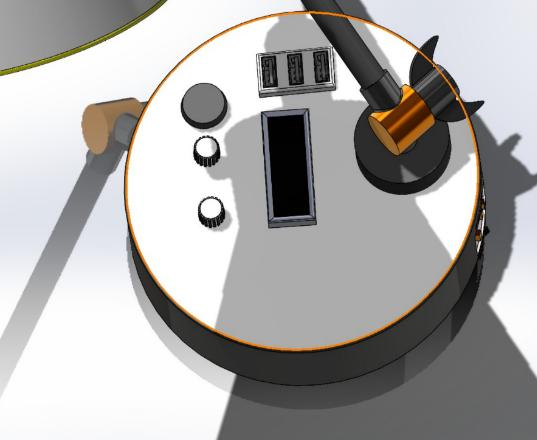
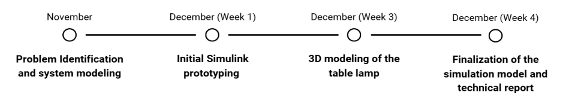
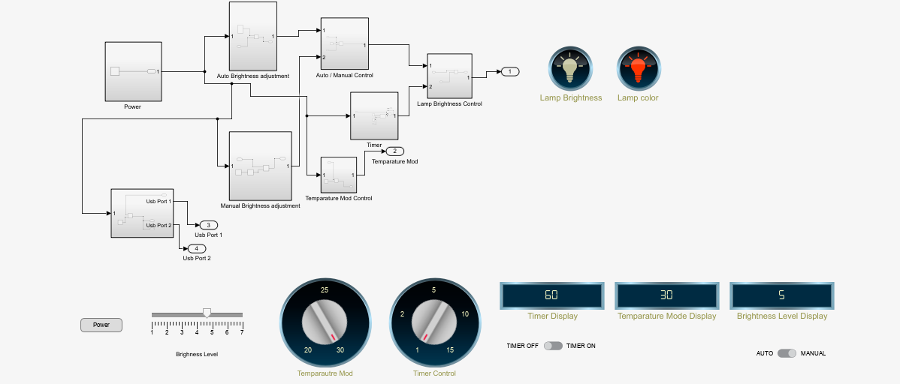
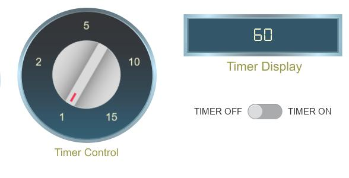
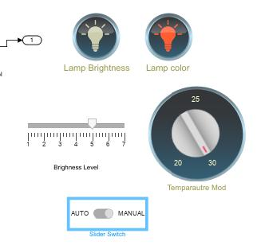
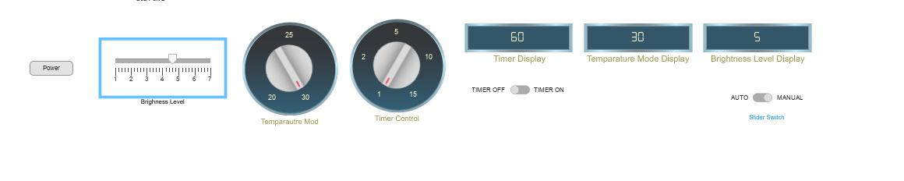

# Automatic Brightness Control LED Lamp for Reading

**EE3204 – Engineering System Design | Semester 03**
**Department of Electrical Engineering, University of Moratuwa**

### Team Members – G23
| Name | Index No. |
|---|---|
| R A H D Rupasinghe | 230553D |
| H S Samahon | 230560V |
| W A K E Sameekshika | 230568D |

---

## Table of Contents
- [Introduction](#introduction)
- [Project Objectives & Performance Targets](#project-objectives--performance-targets)
- [Assumptions & Modeling Constraints](#assumptions--modeling-constraints)
- [Overall Simulation Architecture](#overall-simulation-architecture)
- [Development Timeline](#development-timeline)
- [Subsystem Modeling](#subsystem-modeling)
- [Challenges Faced During Simulation](#challenges-faced-during-simulation)
- [Alternative Modeling Approaches Considered](#alternative-modeling-approaches-considered)
- [Simulation Results & Observations](#simulation-results--observations)
- [Model Validation & Limitations](#model-validation--limitations)
- [Lessons Learned from Simulation-Based Design](#lessons-learned-from-simulation-based-design)
- [Future Improvements](#future-improvements)
- [Conclusion](#conclusion)

---

## Introduction

Inappropriate lighting is a common issue in study environments, where illumination can often be either insufficient or overly concentrated on a small area. Such conditions require users to frequently and manually adjust both the brightness and color temperature of desk lamps depending on the task being performed. This repeated manual intervention is inconvenient and often leads to suboptimal lighting conditions.

Mismatched illumination can cause eye strain, visual discomfort, fatigue, and reduced concentration, especially during prolonged study sessions. Despite the availability of desk lamps with adjustable settings, many systems lack the ability to adapt automatically to changes in ambient light within the room.

To address this issue, this project focuses on the simulation-based design of an intelligent table lamp capable of detecting ambient light intensity and automatically adjusting its brightness accordingly. The system processes sensor data using a microcontroller-based control logic to maintain suitable illumination levels for reading and studying. By incorporating both automatic regulation and manual override options, the proposed model aims to improve visual comfort and reduce the effort required from the user.

  

  

## Project Objectives & Performance Targets

This project's main goal is to create and assess a simulation-based model of an intelligent table lamp that changes its behavior in response to user input and ambient lighting conditions. The system's automated and user-controlled features are intended to enhance visual comfort and usability.

**Functional goals:**
- To put in place a brightness switching mechanism that is both automatic and manual, enabling the system to adjust illumination in response to ambient light levels while permitting user override when necessary.
- To create a color-correlated temperature (CCT) control logic that enables switching between warm and cool lighting modes to accommodate various study tasks.
- To enable time-dependent system behavior by integrating a timer-based control mechanism to facilitate organized study sessions.

**Simulation performance goals:**
- To guarantee steady system outputs free from abrupt fluctuations under a range of input conditions.
- To prevent the brightness control logic from oscillating.
- To keep the simulation environment's automatic and manual control modes switching in a clear and rational manner.

## Assumptions & Modeling Constraints

In this simulation model, several simplifying assumptions were made to focus on system behavior and control logic. The ambient light sensor is assumed to exhibit ideal behavior, producing instantaneous and noise-free outputs with no latency. The LED brightness is modeled as a linear response with respect to the control input, assuming brightness is directly proportional to the processed light intensity. Thermal effects on the LED performance and electronic components are neglected, and power losses within the system are not considered. Under these assumptions, the light sensor output directly represents the brightness level of the environment, allowing the control logic to process illumination changes without accounting for real-world non-idealities.

## Overall Simulation Architecture

The simulation model is developed using integer-based signals and product operations to represent system behavior in a simplified and logical manner. The overall structure follows an input–processing–output approach, where both inputs and outputs are represented using integer values. For example, system states such as power are modeled using constant blocks, where a value of 1 represents the ON state and a value of 0 represents the OFF state. This method allows logical control decisions to be implemented clearly within the simulation environment.

The complete model is divided into several functional subsystems to improve modularity and clarity:
- Auto brightness adjustment subsystem
- Manual brightness adjustment subsystem
- Auto/manual mode controlling subsystem
- Timer subsystem
- Temperature mode control subsystem
- Light brightness control subsystem
- USB ports subsystem
- Lights subsystem

Each subsystem is designed to perform a specific function, enabling easier development, testing, and refinement of the overall simulation model.

## Development Timeline

  

| Milestone | Timeframe |
|---|---|
| Problem Identification and system modeling | November |
| Initial Simulink prototyping | December (Week 1) |
| 3D modeling of the table lamp | December (Week 3) |
| Finalization of the simulation model and technical report | December (Week 4) |

## Subsystem Modeling

The system logic is implemented using integer-based signals and modular subsystems within the Simulink environment. Power control is represented using a constant block with values of 0 and 1, which enables or disables subsystem outputs through product operations. Brightness control is achieved through separate automatic and manual adjustment subsystems, where the automatic mode uses sensor-derived integer values and the manual mode uses a user-controlled slider. A switch block is used to select between these two modes.

Color temperature control is implemented using a rotary switch that modifies constant values to represent different modes. Timer functionality is modeled using a MATLAB Function block to handle time-based logic, while USB ports are simulated using constant power outputs. This modular approach ensures clear signal flow, logical control behavior, and stable system operation within the simulation.

## Challenges Faced During Simulation

Several challenges were encountered during the development of the simulation model. Resetting the timer when its duration was changed or when it was reactivated was difficult due to limitations of the standard timer blocks available in Simulink. This issue was resolved by implementing the timer logic using a MATLAB Function block, which provided greater flexibility and control. Another issue arose when the lamp failed to turn on after the timer had elapsed and was subsequently turned off; this was addressed by using a separate logic path to simulate the power being disabled when the timer expired.

Additionally, managing the overall complexity of the Simulink model was challenging, as accurately simulating real-life lighting systems involves numerous non-ideal factors. To simplify the design and maintain clarity, the system was modeled using integer values and product blocks, allowing the core control logic to be tested effectively.

## Alternative Modeling Approaches Considered

An initial option considered for this project was a simple physical simulation using breadboards and basic electronic components. However, due to the complexity involved in accurately replicating the system behavior and the cost required to obtain the necessary components, a physical implementation was not pursued. Instead, a Simulink-based simulation approach was selected, as it allowed the system logic and control behavior to be developed, tested, and refined efficiently without the constraints of hardware cost and setup complexity.

## Simulation Results & Observations

The system responds correctly to changes in ambient light conditions within the simulation environment. By adjusting the brightness level output from the sensor model, the lamp brightness is automatically and accurately modified to match the simulated light intensity.

When manual override mode is selected, the user is able to control the lamp brightness independently of the sensor output, ensuring predictable behavior. The timer subsystem operates reliably, resetting appropriately whenever the timer settings or operating mode are changed. In addition, the light color output varies according to the temperature mode selected by the user, confirming the correct operation of the color temperature control logic.

  
   <em>Figure: Overall Simulink model</em>

  
  
   <em>Figure: Intensity and temperature controllers &nbsp;|&nbsp; Timer controllers</em>

  
   <em>Figure: User control panels</em>

## Model Validation & Limitations

The correctness of the simulation model was evaluated based on its logical behavior and the expected trends of system outputs under different input conditions. The model was verified by observing whether changes in ambient light, user inputs, and timer settings produced appropriate and consistent responses.

Parameters such as accuracy, sensitivity, and response time were not validated, as these aspects require a physical implementation and depend on real-life electronic components. Additionally, potential sources of error and environmental disturbances that may affect system performance could not be identified within the simulation-only framework.

## Lessons Learned from Simulation-Based Design

This project highlighted the importance of maintaining clear signal flow within a simulation model to ensure predictable and stable system behavior. Designing the system using modular subsystems makes the model easier to develop, test, and debug. A key lesson was the trade-off between realism and complexity, where simplifying assumptions were necessary to keep the simulation manageable.

Debugging large Simulink models requires systematic testing and careful tracing of signals. Overall, the project emphasized the value of proper planning and structured design before building complex simulation models.

## Future Improvements

Further improvements to the model could include the addition of sensor noise to better represent real-world measurement variations and the introduction of signal delays to simulate processing and response times.

Thermal effects and power losses could also be modeled to improve the realism of the system. In addition, the simulation could be extended toward an electronic component–based model as a step toward eventual physical implementation.

## Conclusion

This project successfully developed a simulation model of an intelligent table lamp that can automatically adjust its brightness based on ambient light conditions while also allowing manual user control. The system correctly switches between automatic and manual modes, adjusts color temperature, and operates using a timer to support organized study sessions.

This project demonstrates the importance of simulation in early-stage design. Simulation made it possible to test system behavior and validate control logic without the cost and complexity of physical hardware. The developed model provides a strong foundation for future improvements and real-world implementation.

---

  
  &nbsp;&nbsp;
  

